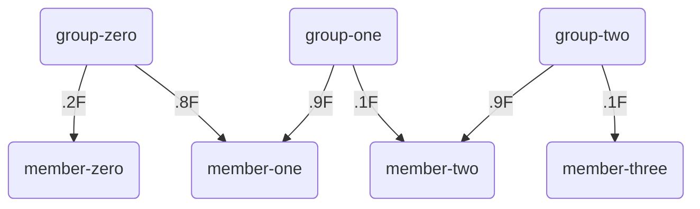
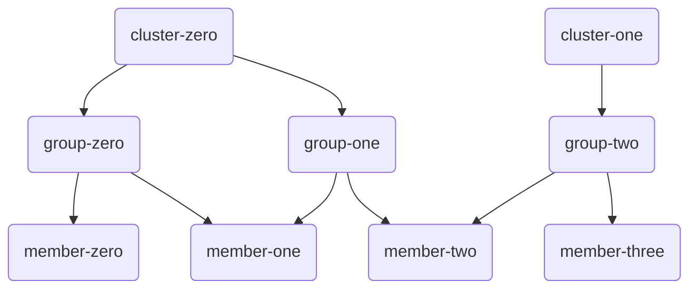

# Description

This library clusters groups based on group member's contributions. For example, suppose we have a collection of forums
and users of those forums. If we want to see which forums are potentially related, we can cluster them based on their
user contributions to each forum.

In this example each forum would correspond to a group and each user would be a member of one or more groups. We could
use their message post frequency, or thread creation, as a way to create a contribution weight for each group. The
agglomerative algorithm would then produce clusters of groups, or forums, who had similar members contributing with
relative frequency.

# Example Usage

Groups and members must be placed into a `MembershipMapping` and passed to the various clustering algorithms. For
agglomerative clustering a minimum squared Euclidean distance must be supplied as well.



```java
MembershipMapping membershipMapping=new MembershipMapping();

membershipMapping.addMemberToGroup("member-zero", "group-zero", .2F);
membershipMapping.addMemberToGroup("member-one", "group-zero", .8F);
membershipMapping.addMemberToGroup("member-one", "group-one", .9F);
membershipMapping.addMemberToGroup("member-two", "group-one", .1F);
membershipMapping.addMemberToGroup("member-two", "group-two", .9F);
membershipMapping.addMemberToGroup("member-three", "group-two", .1F);

AgglomerativeClusterAlgorithm algorithm = new AgglomerativeClusterAlgorithm(membershipMapping, 0.6F);

Set<Cluster> clusters = algorithm.cluster();
```

This will result in two clusters. A cluster that contains `group-zero` and `group-one` and a second cluster that
contains just `group-two`.



# Group Membership Mapping and Clustering Briefly Explained

The most important benefit of the `MembershipMapping` is that it ensures each member is given a unique
vector index which makes comparing Euclidean distance between groups possible. As each member is added to the
mapping the vector space for comparison grows by a dimension. In plain English, if you have two members you have a
cartesian plane, with three members you have three axes, etc. So with two members, groups would have member
contributions `(x, y)` and could be plotted.

An interesting observation is that optimal clustering of groups might be `2^n - 1` clusters, where `n` is the
number of members in the mapping. This assumes you want clusters dominated by a unique set of members and want to
exclude a cluster with no contributions by any member. It still remains to be tested, but you may be able to use a
binary search of minimum distance by repeatedly clustering and scoring the clusters based on how close the count is to
optimal.

The `AgglomerativeClusterAlgorithm` is a naive implementation of a (single-linkage hierarchical clustering
algorithm)[https://en.wikipedia.org/wiki/Single-linkage_clustering] with two heuristics applied. The first heuristic is
that since we are clustering similar groups we can ignore groups that do not have at least one member in common with our
group. While the time complexity is still `n^3`, we can vastly reduce the number of groups needed for comparison with
certain mappings. **It is best to avoid mappings where a member has contributed to the majority of groups as this can
yield very poor performance.**

The second heuristic is that rather than calculating distance to all groups we can stop and merge clusters when we find
a single group within our minimum distance. This heuristic wouldn't be applicable if we were using the cluster centroid
distance, but since we are comparing every group in a cluster for shortest distance we will eventually find all groups
that should be part of the cluster.

# Requirements

- Java 8 or greater.
